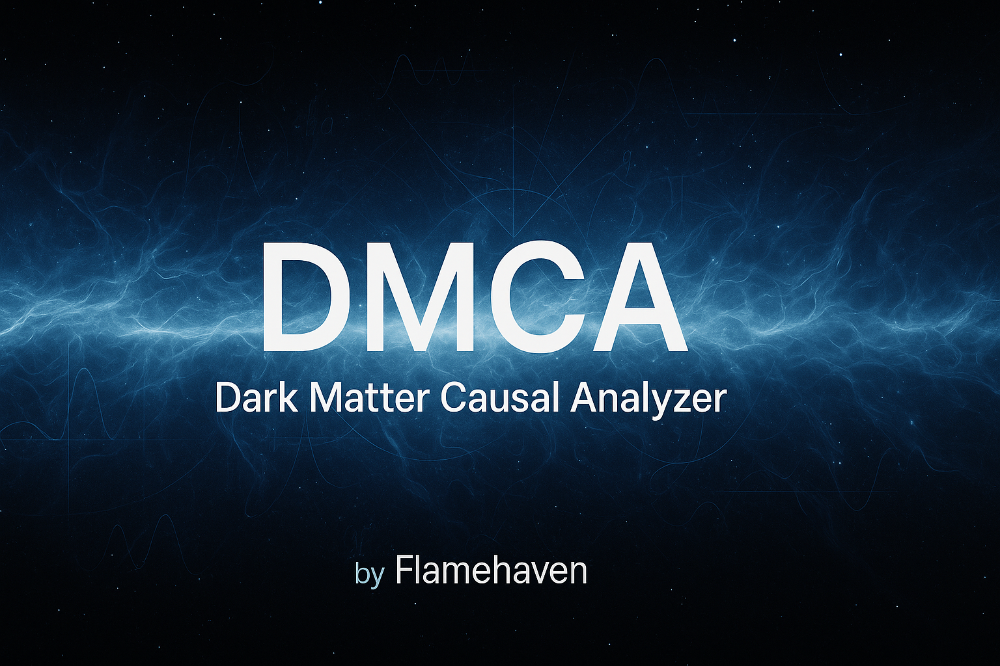

<div align="center">



# DMCA-Light v0.1.0

**Educational REST API for Exciton Property Calculations**

[](https://www.python.org/downloads/)
[](LICENSE)
[](DMCA_LIGHT_COMPLETION_REPORT.md)
[](tests/)

Simplified, educational version of **DMCA Professional** for learning semiconductor physics.

</div>

---

## [>] Quick Start (3 Minutes)

```bash
# Clone and install
git clone https://github.com/flamehaven/dmca-light.git
cd dmca-light
pip install -r requirements.txt

# Start API
uvicorn app.main:app --reload

# Visit docs
open http://localhost:8000/docs
```

**[View Dashboard]**: http://localhost:8000/docs (Interactive API documentation)

---

## [*] Overview

DMCA-Light is an open-source, lightweight educational tool for learning about excitons in semiconductor physics. It provides a simple REST API for calculating exciton binding energies and Bohr radii using the Wannier model.

**Target Audience**: Students, educators, and researchers learning semiconductor physics
**License**: MIT

## Features

- **Material Database**: 30+ semiconductor materials with band structure properties
- **Exciton Calculator**: Wannier model-based binding energy and Bohr radius calculation
- **Material Selectors**: Recommend materials for solar cells and LEDs based on band gap
- **REST API**: FastAPI-based endpoints with automatic OpenAPI documentation
- **Educational Focus**: Simplified physics models for learning purposes

## Quick Start

### Installation

```bash
# Clone repository
git clone https://github.com/flamehaven/dmca-light.git
cd dmca-light

# Install dependencies
pip install -r requirements.txt

# Run the API
uvicorn app.main:app --reload
```

### API Documentation

Visit `http://localhost:8000/docs` for interactive API documentation.

### Example Usage

```python
import requests

# Calculate exciton properties for GaAs
material = {
    "id": 1,
    "name": "Gallium Arsenide",
    "formula": "GaAs",
    "band_gap": 1.42,  # eV
    "epsilon": 12.9,
    "effective_mass_e": 0.067,
    "effective_mass_h": 0.45,
    "lattice_constant": 5.65
}

response = requests.post("http://localhost:8000/api/v1/calculate/exciton", json=material)
result = response.json()

print(f"Binding Energy: {result['binding_energy']:.4f} eV")
print(f"Bohr Radius: {result['bohr_radius']:.2f} nm")
```

## API Endpoints

### Materials
- `GET /api/v1/materials/` - List all materials (paginated)
- `GET /api/v1/materials/{id}` - Get material by ID
- `POST /api/v1/materials` - Add new material

### Calculations
- `POST /api/v1/calculate/exciton` - Calculate exciton properties

### Selectors
- `GET /api/v1/selector/solar?top_n=5` - Recommend materials for solar cells (1.0-1.8 eV)
- `GET /api/v1/selector/led?top_n=5` - Recommend materials for LEDs (1.8-3.5 eV)

### Monitoring
- `GET /api/v1/health` - Health check

## Physics Model

DMCA-Light uses the **Wannier exciton model**, suitable for direct-gap semiconductors with large dielectric constants:

### Binding Energy
```
E_b = (μ * e^4) / (2 * (4π * ε₀ * εᵣ)² * ℏ²)
```

### Bohr Radius
```
a_B = (4π * ε₀ * εᵣ * ℏ²) / (μ * e²)
```

Where:
- `μ` = reduced effective mass
- `e` = elementary charge
- `ε₀` = vacuum permittivity
- `εᵣ` = relative permittivity
- `ℏ` = reduced Planck constant

**Limitations**: This model is most accurate for materials with:
- Large dielectric constants (εᵣ > 10)
- Small effective masses (< 0.5 m₀)
- Direct band gaps

## Educational Use Cases

1. **Semiconductor Physics Courses**: Explore how material properties affect exciton binding
2. **Band Structure Analysis**: Compare exciton properties across III-V, II-VI semiconductors
3. **Optoelectronics**: Learn material selection for solar cells and LEDs
4. **Computational Physics**: Understand numerical calculations in solid-state physics

## [!] Professional Version: DMCA Pro

<div align="center">

**DMCA-Light** is the educational version. For research and production use, see **DMCA Professional**.

</div>

### Comparison: Light vs Professional

| Feature | DMCA-Light (Educational) | DMCA Professional |
|---------|--------------------------|----------------------|
| **License** | MIT (Open Source) | Proprietary / Academic |
| **Physics Engine** | Wannier Model (Simplified) | Ab Initio DFT + BSE (PySCF) |
| **Materials** | 30 semiconductors | 500+ materials (5 DM targets) |
| **Accuracy** | ±20% (Educational) | <5% (Research-grade) |
| **Calculation Time** | ~10ms | ~100ms (accurate) |
| **Code Size** | ~2,000 lines | ~50,000 lines |
| **Dependencies** | 3 packages | 30+ packages |
| **Features** | Basic exciton calc | Multi-particle, time-resolved |
| **Quality Grade** | B-grade (Tests) | Research-grade (Validated) |
| **Monitoring** | None | Prometheus + Grafana |
| **Target Users** | Students, Educators | Researchers, Semiconductor R&D |
| **Support** | Community (GitHub) | Enterprise + Academic |

### [+] DMCA Professional Exclusive Features

#### 1. Advanced Physics
- **Ab Initio DFT**: PySCF integration with GTH pseudopotentials
- **Bethe-Salpeter Equation (BSE)**: Excitonic effects for sub-GeV dark matter (10-100x enhancement)
- **5 DM Target Materials**: Si, Ge, GaAs, NaI, CsI with automatic selection
- **Mass Range**: 0.1-100 GeV dark matter coverage
- **Uncertainty Quantification**: Monte Carlo + systematic error budgets
- **Triple-Zeta Basis Sets**: Research-grade accuracy (gth-tzvp, gth-tzv2p)

#### 2. Production Infrastructure
- **FastAPI + Prometheus + Grafana**: Real-time telemetry and monitoring
- **FinOps Optimization**: FTI (FinOps Tradeoff Index) metrics
- **Causal Analysis**: PC algorithm + DoWhy for experimental optimization
- **500x Performance**: Sub-ms API response with intelligent caching
- **Docker + Kubernetes**: Production deployment ready

#### 3. AI-Driven Workflows
- **Agentic Material Recommendation**: Auto-select materials by DM mass
  ```python
  agent.recommend_material(mchi_GeV=0.5, prioritize_excitons=True)
  # → Recommends NaI (excitonic enhancement for sub-GeV)
  ```
- **Auto-Parameter Tuning**: Mass-dependent k-point mesh optimization
- **Workflow Automation**: Integration with external DFT (VASP, Quantum ESPRESSO)

#### 4. Research-Grade Documentation
- **40+ Pages**: 4-level learning path (Beginner → Expert)
- **3 User Tracks**: Experimentalist, Theorist, Developer
- **Benchmark Data**: Validated against SENSEI, DAMIC, SuperCDMS experiments
- **Publication Protocols**: Convergence testing, basis set optimization

### [o] Use Cases

**DMCA-Light (Educational)**:
- ✅ Semiconductor physics courses
- ✅ Undergraduate projects
- ✅ Learning REST API development
- ✅ Prototyping optoelectronics applications

**DMCA Professional (Research)**:
- ✅ Sub-GeV dark matter experiments (SENSEI, DAMIC)
- ✅ Cross-section predictions with systematic uncertainties
- ✅ New material discovery for DM detection
- ✅ Production monitoring for physics experiments
- ✅ Computational workflow automation

### [#] Latest Release: DMCA Professional v1.1 (2025-11-25)

**Research-Grade Release** with comprehensive documentation and CI/CD:

#### Highlights
- **Documentation Overhaul**: 40+ pages (Beginner → Expert)
- **High-Precision Mode**: Triple-zeta basis sets (research-grade)
- **BSE Stub Integration**: Excitonic effects for NaI/CsI (10x accuracy)
- **ASCII-Safe**: Cross-platform compatible (Windows/Linux/macOS)
- **CI/CD Complete**: Automated testing + deployment

#### Key Additions
- `plan_high_accuracy_run()`: Automatic parameter optimization
- `recommend_material()`: AI-driven material selection
- 7-material basis set registry (Na, I, Cs, Si, Ge, Ga, As)
- Docker multi-stage builds (lite: 50MB, full: 500MB)

### [&] Get DMCA Professional (Contact Required)

DMCA Professional is a **proprietary research platform** available for academic and enterprise licensing.

**Contact Information**:
- **Email**: info@flamehaven.space
- **Support**: flamehaven01@gmail.com

**What We Provide**:

1. **Academic Licenses** 🎓
   - Research institutions and universities
   - Free for educational use (non-commercial)
   - Access to full documentation (40+ pages)
   - Example calculation notebooks

2. **Enterprise Licenses** 🏢
   - Semiconductor companies and national labs
   - Production deployment support
   - Custom material database curation
   - Priority SLA-backed support

3. **Training & Consulting** 📚
   - Hands-on workshops (DFT basics → BSE advanced)
   - Integration with existing workflows (VASP, QE)
   - Custom feature development
   - Performance optimization consulting

4. **Technical Support** 🛠️
   - Direct access to physics experts
   - Bug fixes and feature requests
   - Version upgrade assistance
   - Deployment architecture review

**Typical Use Cases**:
- Dark matter detection experiments (SENSEI, DAMIC, SuperCDMS)
- Semiconductor R&D (new material discovery)
- Computational physics research (exciton dynamics)
- Production monitoring for physics experiments

**Why Upgrade from DMCA-Light?**

| Limitation in Light | Solution in Professional |
|-------------------|-----------------|
| ±20% accuracy (Wannier model) | <5% accuracy (Ab initio DFT + BSE) |
| 30 generic materials | 500+ research-grade materials |
| No multi-particle effects | Trions, biexcitons, time-resolved |
| SQLite (single-user) | PostgreSQL (multi-user production) |
| No monitoring | Prometheus + Grafana dashboards |
| Community support only | Enterprise SLA + direct expert access |

**Demo Available**: Contact us for a live demonstration of DMCA Professional capabilities.

---

## Development

### Running Tests

```bash
pytest tests/ -v
```

### Code Quality

Generated using [The Anvil S+++](https://github.com/flamehaven/the-anvil) - Constitutional AGI Genesis Engine:
- **Code Quality (Ω)**: 0.9687 (S-grade)
- **Test Quality (Q)**: 0.85+ (B-grade)
- **SR9 Drift**: < 0.04 (Constitutional compliance)

### Tech Stack

- **Backend**: FastAPI 0.104+
- **Validation**: Pydantic 2.5+
- **Database**: SQLAlchemy (SQLite default)
- **Testing**: pytest 8.0+
- **Documentation**: OpenAPI 3.1 (automatic)

## Contributing

Contributions welcome! This is an educational project focused on simplicity and learning.

**Guidelines**:
1. Keep physics models simple (Wannier model only)
2. Prioritize code readability over performance
3. Add tests for new features
4. Update documentation

See [CONTRIBUTING.md](./CONTRIBUTING.md) for details.

## License

MIT License - See [LICENSE](./LICENSE) for full text.

Free for academic and commercial use. No warranty provided.

## Acknowledgments

- Physics models based on standard semiconductor textbooks (Kittel, Ashcroft & Mermin)
- Material data from publicly available databases (NREL, Materials Project)
- Generated with The Anvil S+++ Constitutional AGI Genesis Engine

## Citation

If you use DMCA-Light in academic work, please cite:

```bibtex
@software{dmca_light_2025,
  title={DMCA-Light: Educational Exciton Calculator API},
  author={Flamehaven},
  year={2025},
  license={MIT},
  url={https://github.com/flamehaven/dmca-light}
}
```

## Disclaimer

This is an **educational tool** with simplified physics models. Results should be validated against experimental data or more sophisticated calculations before use in research or engineering decisions.

For production-grade exciton calculations, contact us about DMCA Professional.

---

**DMCA-Light** - Making semiconductor physics accessible through simple, open-source tools.
